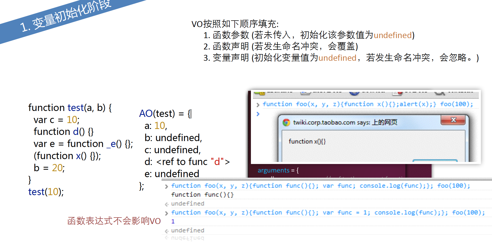
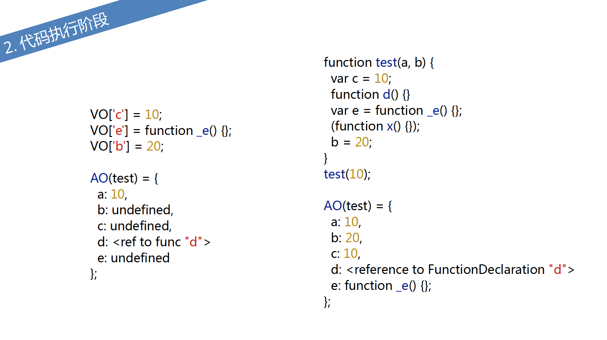

# 函数Function
##函数的返回值依赖于return语句
1. 一般函数调用没有return语句，在语句执行后，返回undefined
2. 作为构造器，外部使用new去调用的话，默认没有return语句，或者return基本类型，会将this作为返回值。
反之return这个对象的构造器。那么将这个对象作为new这个构造器这样的操作一个返回值。

## 函数的不同调用方式
1. 直接调用
2. 作为对象的方法 o.method();
3. 构造器 new Foo();
4. call/apply/bind 

## 函数的声明与表达式

1. 函数声明会前置
2. 函数表达式 
```js
var add = function (a, b) {
  // do sth.
}

// IEF (Immediately Executed Function)
(function() {
  // do sth.
})()

// first-class function
return function() {
  // do sth
}

NFE (Named Function Expression)
var add = function foo(a, b) {
  // do sth
}
```

```js
var num = add(1, 2); // 相当于var add; 报TypeError: undefined is not a function

console.log(num);

var add = function(a, b) {
  a = +a;
  b = +b;
  if(isNaN(a) || isNaN(b)) {
    return;
  }
  return a + b;
}
```
## 命名函数表达式
```js
var func = function nfe() {};
alert(func === nfe); // IE6~8 false IE9+ 'nfe' is undefined

//递归调用
var func = function nfe() {/** do sth **/ nfe();}
```

## Function 构造器

Function构造器里面参数局部变量
```js
var func = new Function('a', 'b', 'console.log(a+b)'); // 前面参数代表形参，最后是函数体
var func = Function('a', 'b', 'console.log(a+b)'); // 两者一样
```

```js
// case1
Function('var localVal = 'local'; console.log(localVal);')();
console.log(typeof localVal); // result local, undefined
// case 2
var globalVal = 'global';
(function() {
  var localVal = 'local';
  Function('console.log(typeof localVal, typeof global'); // localVal 特殊性，取不到 undefined 但是全局变量可以取得
})()
```
## 函数声明前置 不予许匿名和立即调用
函数表达式和函数构造器允许匿名和立即调用，函数构造器可以没有函数名

## JavaScript 中的this
1. 全局作用域 this === window
2. 一般函数this指向全局window，但是严格模式this指向undefined

```js
function f() {
  return this;
}
f() === window // true 在node下指global

// 严格模式
function f2() {
  'use strict';
  return this;
}

f2 === undefined;
```

3. 函数(作为对象方法的函数this) 指向这个对象
```js
var o = {
  props: 37,
  f: function() {
    return this.props; // this指向o
  }
}
console.log(o.f())
```
但是：
```js
var o = {props: 37};
function independent() {
  return this.props;
}

o.f = independent; // 临时创建属性f
console.log(o.f()); // 37
```

4. 对象原型链上的this
 ```js
 var o = {
   f: function() {
     return this.a + this.b;
   }
 }

 var p = Object.create(o);
 p.a = 1;
 p.b = 4;

 console.log(p.f()); // 5 调用原型链上的方法this指向p
 ```

 5. get / set 方法所在的对象与this 指向这个对象
 ```js
 function modules() {
   return Math.sqrt(this.re * this.re, this.im * this.im)
 }

 var o = {
   re: 1,
   im: -1,
   get phase() {
     return Math.atan2(this.im, this.re)
   }
 }

 Object.defineProperty(o, 'modules', {
   get: modules, enumerable: true, configurable: true
 })

 console.log(o.phase, o.modules); // -0.78 1.4142
 ```
 6. 构造器中的this
 正常调用
 ```js
 function MyClass() {
   this.a = 37; // this指向全局变量，默认this作为返回值
 }

 var o = new MyClass(); // 创建一个空对象，this指向空对象o，并且原型指向MyClass的prototype
 console.log(o.a); // 37

 function C2() {       // 无return语句或return为基本类型会将this作为返回值，如果有return并且return一个对象会将这个对象作为返回值
   this.a = 37;        // 这样 o 为 {a: 38}
   return {
     a: 38
   };
 }

 o = new C2();
 console.log(o.a); //38
 ```

7. call/apply方法与this
```js
function add(c, d) {
  return this.a + this.b + c +d
}

var o = {a: 1, b: 3};
add.call(o, 5, 7); // o想作为this的对象o 1+3+5+7=16
add.apply(o, [10, 20]); // 1+3+10+20

function bar() {
  console.log(Object.prototype.toString.call(this)); // 指定其中this
}

bar.call(7); // "[Ooject Number]"
```

8. bind方法与this
```js
function f() {
  return this.a;
}

var g = f.bind({a: 'test'});
console.log(g()); // test

var o = {a: 37, f:f, g:g}
console.log(o.f(), o.g()); // o.f()对象上的属性， o.g()作为对象上的新属性， 按照绑定g test
```

apply / call方法（浏览器）
```js
function foo(x, y) {
  console.log(x, y, this);
}

foo.call(100, 1, 2); // 1, 2, this作为基本类型，会转为包装对象 Number(100)

foo.apply(true, [3, 4]); // 3, 4, Boolean(true)

foo.apply(null); // undefined undefined, null -> window

foo.apply(undefined); // undefined, undefined window
```

但是严格模式下
```js
function foo(x, y) {
  'use strict';
  console.log(x, y, this);
}

foo.apply(null); // undefined undefined null
foo.apply(undefined); // undefinde undefined undefined
```

bind 方法
```js
this.x = 9;
var module = {
  x: 81,
  getX: function() {
    return this.x;
  }
}

module.getX(); // 81

var getX = module.getX;
getX(); // 9  赋值给一个变量，变量执行环境全局作用域

function independent() { // 注意对比 临时创建属性f
  return this.x;
}

module.f = independent;
console.log(module.f()); // 81

var boundGetX = getX.bind(module);
boundGetX(); // 81
```

### bind与函数curring
```js
function add(a, b, c) {
  return a+b+c;
}

var func = add.bind(undefined, 100); //  bind undefined 不会改变this指向
func(1, 2); // 传入参数100， 默认100 -> a, 1 -> b, 2 -> c  so result 103

var func2 = add.bind(undefined, 200);
func2(10); // 310 100 -> a, 200 -> b, 10 -> c
```

```js
function getConfig(colors, size, otherOptions) {
  console.log(colors, size, otherOptions);
}

var defaultConfig = getConfig.bind(null, '#C00', '1024 * 768');
defaultConfig('123'); // #C00 1024* 768 123
defaultConfig('456'); // #C00 1024* 768 456
```

bind 与new
```js
function foo() {
  this.b = 100;
  return this.a;
}

var func = foo.bind({a: 1}); // 字面量对象 this指向这个参数
func(); // 1
// return 除非是对象，否则会将this作为返回值，并且this会被初始化空对象，并且这个对象的原型指向foo.prototype,整个对象作为返回值返回
new func(); // {b: 100} 即使bind方法，空对象指向foo.prototype,.bind会忽略掉
```

bind 1. 改变this指向 2. 参数 curring
### 判断this指向（1~4逐级降低）
1. 函数被new调用，this指向由new新构造出来的对象
2. 函数通过call， apply, bind调用this指向被绑定的对象
3. 函数作为方法调用， this指向对象
4. 默认非严格模式情况下，this指向window，node下global， 严格模式，this指向undefined

## 函数arguments
arguments为类数组对象，arguments原型不是数组，所以没有Array.prototype.slice(),join()方法
arguments会改变形参
```js
function foo(x, y, z) {
  arguments.length; // 2
  arguments[0]; // 1
  arguments[0] = 10;
  x; // change to 10; 严格模式下仍是1

  arguments[2] = 100;
  z; // still undefined 未传参数，失去绑定关系
  arguments.callee === foo; // true 严格模式arguments.callee不能用
}

foo(1, 2);
foo.length; // 形参个数3
foo.name; // foo
```
严格模式下 arguments不会修改形参
callee 是 arguments 对象的一个属性。
它可以用于引用该函数的函数体内当前正在执行的函数。这在函数的名称是未知时很有用，例如在没有名称的函数表达式 (也称为“匿名函数”)内。
在严格模式下，第5版 ECMAScript (ES5) 禁止使用 arguments.callee()。
当一个函数必须调用自身的时候, 避免使用 arguments.callee(), 通过要么给函数表达式一个名字,要么使用一个函数声明.
arguments.callee === foo; // true 不能用


## 闭包
```js
function outer() {
  var localVal = 30; 
  return localVal; // 立刻回收
}

outer(); // 30

function outer() {
  var localVal = 30;
  return function() { // 匿名函数
    return localVal;
  }
}

var func = outer(); // 返回匿名函数仍能访问
func(); // 30 访问outer内部变量localVal
```

## 闭包无处不在
```js
!function() { // 绑定点击事件
  var localData = 'localData here';
  document.addEventListener('click', function() {
    console.log(localData); // addEventListener是一个回调函数
  })
}()

!function() {
  var localData = 'localData here';
  var url = 'www.baidu.com';
  $.ajax({
    url: url,
    success: function() {
      // do sth.
      console.log(localData);
    }
  })
}
```

## 闭包--常见错误之循环闭包
```js
document.body.innerHTML = "<div id=div1>aaa</div>"
+ "<div id=div2>bbb</div><div id=div3>ccc</div>";
for (var i = 1; i < 4; i++) {
document.getElementById('div' + i).
  addEventListener('click', function() { // addEventListener是一个回调函数，拿到 i = 4 利用立即执行的匿名函数包装起来， 取闭包环境下的i
    alert(i); // all are 4!
  });
}

// 修改优化， 立即调用，每次绑定i
document.body.innerHTML = "<div id=div1>aaa</div>"
+ "<div id=div2>bbb</div><div id=div3>ccc</div>";
for (var i = 1; i < 4; i++) {
  !function(i) {
  document.getElementById('div' + i).
  addEventListener('click', function() {
  alert(i); // 1, 2, 3
  });
  }(i);
  }
```

## 闭包 -> 封装
## 闭包缺点 (导致作用域循环引用，造成内存泄漏)

## 作用域
JavaScript无块级作用域
1.  全局作用域 2. 函数作用域 3. eval作用域
```js
var a = 10;
(function() {
var b = 20;
})();
console.log(a); // 10
console.log(b); // error, b in not defined
for (var item in {a : 1, b : 2}) {
console.log(item);
}
console.log(item); // item still in scope
eval("var a = 1;");
```

```js
for(var item in {a: 1, b: 2}) { // 注意for循环
  console.log(item);
}
console.log(item); // 能访问
```

## 作用域链
```js
function outer2() {
  var local2 = 1;
  function outer1() {
    var local1 = 1;
    // visit local1, local2 or global3
  }
  outer1();
}
var global3 = 1;
outer2();
function outer() {
  var i = 1;
  var func = new Function("console.log(typeof i);");
  func(); // undefined
}
outer();
```
## 利用函数作用域封装
```js
(function() {
  // do sth here
  var a, b;
})();

!function() {
  // do sth here
  var a, b;
}();
```

ES3 执行上下文<执行环境 | 执行上下文> 类似栈
```js
console.log('EC0');
function funcEC1() {
  console.log('EC1');
var funcEC2 = function() {
  console.log('EC2');
var funcEC3 = function() {
  console.log('EC3');
};
  funcEC3();
}
funcEC2();
}
funcEC1();
  // EC0 EC1 EC2 EC3
```

## JS解释器如何找到我们定义的函数和变量？
变量对象(Variable Object, 缩写为VO)是一个抽象
概念中的“对象”，它用于存储执行上下文中的：1.变量 2. 函数声明 2. 函数参数

VO按照如下顺序填充:
1. 函数参数
(若未传⼊入，初始化该参数值为undefined)
2. 函数声明
(若发⽣生命名冲突，会覆盖)
3. 变量声明
(初始化变量值为undefined，若发⽣生命名冲突，会忽略。)



